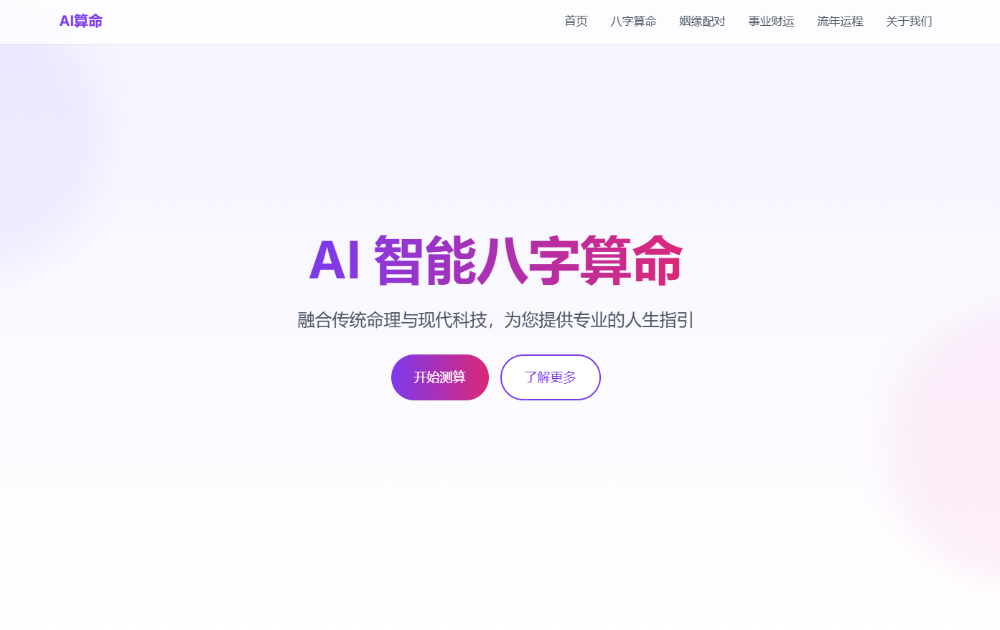

# AI 八字算命网站

基于 Next.js 14 和 Deepseek AI 打造的现代化八字算命平台。

##截图赏析

## 功能特点&变现

- 现代简约的用户界面设计
- 基于 AI 的八字算命分析
- 响应式设计，支持所有设备
- 服务器端渲染确保最佳性能
- 对接大淘客api，增加变现渠道

## 核心功能模块

1. 首页
   - 优雅的hero section展示
   - 服务介绍
   - 算命流程说明
   - 用户见证/反馈展示

2. 算命系统
   - 生辰八字输入界面
   - AI 分析结果展示
   - 详细解读页面

3. 知识库
   - 八字基础知识
   - 命理学文章
   - FAQ常见问题

## 技术栈

- Next.js 14 (App Router)
- TypeScript
- Tailwind CSS
- Framer Motion (动画效果)
- DeepSeek AI API

##赠人咖啡，唇齿留香

## 不足之处
- 目前ai的算命结果还需要人工干预，可以自行改写训练语句
- 只完成了主要的页面设计，其余页面还未优化
- ai处理结果时间较长，需要优化

##注意
本项目使用 MIT 协议进行开源，在此基础上，必须在页面底部保留署名以及指向本项目的链接。如果不想保留署名，必须首先获得授权。

同样适用于基于本项目的二开项目。

依据 MIT 协议，使用者需自行承担使用本项目的风险与责任，本开源项目开发者与此无关。